# Tasko Backend — Database Architecture Reference

**Status:** Documents the database exactly as it exists in the current codebase, verified directly against every entity file, both migrations (baseline + findings fixes), and every ADR. Nothing here is proposed or aspirational unless explicitly labeled as a finding/recommendation in Section 10.
**Engine decision (not up for debate in this document):** TypeORM on PostgreSQL in production, SQLite as the local/test convenience tier. This document describes that reality precisely; it does not propose an alternative.

---

## 1. Overview

### Database engine and the rule governing which is used
- **Production:** PostgreSQL, selected when `DB_TYPE=postgres`.
- **Local/test:** SQLite via the `better-sqlite3` driver, selected when `DB_TYPE=sqlite` (the default when `DB_TYPE` is unset).
- The exact rule is enforced in `src/infrastructure/database/database.module.ts`'s `buildTypeOrmOptions()`: `synchronize` is read from `DB_SYNCHRONIZE` for the sqlite branch, but for the Postgres branch the function **hard-throws at startup** if `DB_SYNCHRONIZE=true` is ever combined with `DB_TYPE=postgres` — this isn't a silent override, it's a fail-fast guard. This directly implements ADR-0004's stated policy: *"synchronize is enabled only for sqlite tiers... it is never enabled for Postgres."*
- Both drivers share the exact same TypeORM entity classes; no entity is conditional on driver.
- One driver-specific accommodation exists (per ADR-0004): all date/time columns use `type: 'datetime'` explicitly, because `better-sqlite3` doesn't support `type: 'timestamp'` or an inferred `Object` type for nullable dates. The baseline migration compensates for this by using `type: 'timestamp'` directly in its driver-agnostic `Table` API calls — the migration's abstraction layer maps this correctly for both drivers at the SQL-generation level, independent of the entity-level `datetime` type name.

### ORM and migration tooling
- **ORM:** TypeORM 1.x (confirmed via the `@nestjs/typeorm` peer dependency and `DataSource`/`Table`/`TableForeignKey` APIs used throughout).
- **Migration CLI:** driven by `src/database/data-source.ts`, a standalone `DataSource` (separate from the Nest `DatabaseModule`, since the TypeORM CLI can't resolve Nest's DI container) that reads the same `DB_*` env vars and defaults to sqlite when `DB_TYPE` is unset, so migrations can be authored and tested locally without Postgres.
- **The real npm scripts** (from `package.json`):
  - `npm run migration:generate` → `typeorm migration:generate` (dev, via `ts-node`)
  - `npm run migration:run` / `npm run migration:revert` / `npm run migration:show` (dev)
  - `npm run migration:run:prod` / `npm run migration:show:prod` → run against the **compiled** `dist/database/data-source.js`, used by the CI `postgres` job and intended for real deployment.
- Migration file discovery: `migrations: [__dirname + '/migrations/[0-9]*.{ts,js}']` — a glob that only matches filenames starting with a digit (the timestamp prefix), specifically so `.spec.ts` files living alongside migrations in the same directory are never picked up by the CLI (there's a code comment explaining this exact reasoning).

### UUID strategy
Verified per-entity, not assumed uniform:
- **Task** — the one entity with a documented, deliberate **client-generated UUID** strategy: *"the id is normally supplied by the Tasko client (UUID v4) so optimistic updates stay idempotent; the server generates one only when omitted"* (comment directly on `TaskEntity`). This is a real behavioral decision, not just a comment — `CreateTaskDto` accepts an optional `id`.
- **Every other entity** (`User`, `Team`, `Category`, `Tag`, `Comment`, `Invitation`, `File`, `UserSettings`, `RefreshToken`, `PasswordResetToken`, `EmailVerificationToken`, `ActivityLog`, `Notification`, `UserDevice`, `TeamMember`) uses `@PrimaryGeneratedColumn('uuid')` — server-generated. On Postgres, the migration gives these a `uuid_generate_v4()` default; on sqlite, TypeORM generates the UUID in application code before insert (sqlite has no native UUID generation function, so this is an intentional driver-conditional accommodation, not an inconsistency — see the `uuidPk()` helper in the baseline migration, which only sets `.default` when `postgres === true`).

---

## 2. Entity-Relationship Diagram

```mermaid
erDiagram
    USERS ||--o{ TASKS : owns
    USERS ||--o{ CATEGORIES : owns
    USERS ||--o{ TAGS : owns
    USERS ||--o{ TEAMS : "owns (owner_id, no FK)"
    USERS ||--o{ TEAM_MEMBERS : "is (user_id, no FK)"
    USERS ||--o{ COMMENTS : "authors (user_id, no FK)"
    USERS ||--o{ FILES : "owns (user_id, no FK)"
    USERS ||--o{ USER_SETTINGS : "has (user_id, no FK)"
    USERS ||--o{ REFRESH_TOKENS : "has (user_id, no FK)"
    USERS ||--o{ PASSWORD_RESET_TOKENS : "has (user_id, no FK)"
    USERS ||--o{ EMAIL_VERIFICATION_TOKENS : "has (user_id, no FK)"
    USERS ||--o{ NOTIFICATIONS : "receives (user_id, no FK)"
    USERS ||--o{ ACTIVITY_LOGS : "has (user_id, no FK)"
    USERS ||--o{ USER_DEVICES : "registers (user_id, no FK)"
    USERS ||--o| FILES : "avatar_file_id (no FK, denormalized)"

    TEAMS ||--o{ TEAM_MEMBERS : "has (FK, CASCADE)"
    TEAMS ||--o{ CATEGORIES : "scopes (FK, CASCADE)"
    TEAMS ||--o{ TAGS : "scopes (FK, CASCADE)"
    TEAMS ||--o{ TASKS : "scopes (FK, CASCADE)"
    TEAMS ||--o{ INVITATIONS : "issues (FK, CASCADE)"

    TASKS ||--o{ COMMENTS : "has (FK, CASCADE)"
    TASKS }o--o| CATEGORIES : "classified by (FK, SET NULL)"
    TASKS }o--o{ TAGS : "tagged with (task_tags, CASCADE both sides)"

    USERS {
        uuid id PK
        string email UK
        string password_hash
        string first_name
        string last_name
        varchar role
        boolean is_email_verified
        uuid avatar_file_id "no FK"
    }
    TEAMS {
        uuid id PK
        uuid owner_id "no FK, denormalized"
        varchar name
        text description
    }
    TEAM_MEMBERS {
        uuid id PK
        uuid team_id FK
        uuid user_id "no FK"
        varchar role
    }
    TASKS {
        uuid id PK "client-generated"
        uuid user_id "no FK"
        uuid team_id FK "nullable"
        uuid category_id FK "nullable, SET NULL"
        varchar title
        varchar time
        varchar date "raw label, not a DATE type"
        boolean is_done
        varchar priority
    }
    CATEGORIES {
        uuid id PK
        uuid user_id "no FK"
        uuid team_id FK "nullable"
        varchar name
    }
    TAGS {
        uuid id PK
        uuid user_id "no FK"
        uuid team_id FK "nullable"
        varchar name
    }
    TASK_TAGS {
        uuid task_id PK_FK
        uuid tag_id PK_FK
    }
    COMMENTS {
        uuid id PK
        uuid task_id FK
        uuid user_id "no FK"
        text body
    }
    INVITATIONS {
        uuid id PK
        uuid team_id FK
        varchar email
        varchar token_hash UK
        varchar role
        varchar status
        uuid invited_by "no FK"
        uuid invited_user_id "no FK, nullable"
    }
    FILES {
        uuid id PK
        uuid user_id "no FK"
        varchar kind
        varchar storage_key
    }
    USER_SETTINGS {
        uuid id PK
        uuid user_id UK "no FK"
        boolean dark_mode
        varchar language
    }
    REFRESH_TOKENS {
        uuid id PK
        uuid user_id "no FK"
        varchar token_hash UK
        uuid family_id "indexed"
        boolean is_revoked
    }
    PASSWORD_RESET_TOKENS {
        uuid id PK
        uuid user_id "no FK"
        varchar token_hash UK
    }
    EMAIL_VERIFICATION_TOKENS {
        uuid id PK
        uuid user_id "no FK"
        varchar token_hash UK
    }
    NOTIFICATIONS {
        uuid id PK
        uuid user_id "no FK"
        uuid event_id UK
        varchar type
        boolean is_read
    }
    ACTIVITY_LOGS {
        uuid id PK
        uuid user_id "no FK"
        uuid event_id UK
        varchar type
        uuid entity_id
    }
    USER_DEVICES {
        uuid id PK
        uuid user_id "no FK"
        varchar token UK
    }
```

*Diagram note:* every relationship labeled "no FK" is a real, deliberate schema state confirmed directly in the migrations — not a diagramming shorthand. See Section 4 and Section 10 for why. The former lone exception (`files.user_id` had an FK) no longer exists — the schema is now uniform.

---

## 3. Table-by-Table Reference

### `users` — `src/modules/user/entities/user.entity.ts`
| Column | Type | Null | Default | Purpose |
|---|---|---|---|---|
| `id` | uuid | no | `uuid_generate_v4()` (pg only) | PK |
| `email` | varchar(255) | no | — | Login identity |
| `password_hash` | varchar(255), `select: false` | no | — | Argon2id hash; never selected by default queries |
| `first_name` | varchar(100) | no | — | Entity property `firstName`, mapped via `@Column({ name: 'first_name' })` |
| `last_name` | varchar(100) | no | — | Entity property `lastName`, mapped via `@Column({ name: 'last_name' })` |
| `role` | varchar(20) | no | `'USER'` | `Role.USER` \| `Role.ADMIN` |
| `is_email_verified` | boolean | no | `false` | |
| `email_verified_at` | datetime | yes | — | |
| `last_login_at` | datetime | yes | — | |
| `avatar_file_id` | uuid | yes | — | Denormalized pointer into `files`; no FK (see Section 4) |
| `created_at` / `updated_at` | timestamp | no | — | |

**PK strategy:** server-generated UUID. **FKs:** none — this table is only ever a *target*, never a source, of FK relationships. **Unique constraints:** `email` (unique index). **Soft delete:** none — this table uses hard delete (no `deletedAt`/`isDeleted` column anywhere in the entity, and no soft-delete decorator such as `@DeleteDateColumn`). There is currently no account-deletion endpoint anywhere in the API, so this has never been exercised in practice — see Section 10.

### `teams` — `src/modules/team/entities/team.entity.ts`
| Column | Type | Null | Default | Purpose |
|---|---|---|---|---|
| `id` | uuid | no | pg default | PK |
| `owner_id` | uuid, indexed | no | — | Denormalized owner pointer; *"the owner's membership row in `team_members` is the source of truth for the OWNER role"* (entity docstring) |
| `name` | varchar(60) | no | — | |
| `description` | text | yes | — | |
| `created_at` / `updated_at` | timestamp | no | — | |

**FKs:** none. **Soft delete:** hard delete. **Load-bearing invariant:** a team row is never created without a corresponding `team_members` OWNER row — this is a transactional guarantee implemented in the repository layer (`TypeOrmTeamRepository.create()`), not a database constraint. See Section 4 for the precise mechanism.

### `team_members` — `src/modules/member/entities/team-member.entity.ts`
| Column | Type | Null | Default | Purpose |
|---|---|---|---|---|
| `id` | uuid | no | — | PK |
| `team_id` | uuid, indexed | no | — | FK → `teams.id`, **`ON DELETE CASCADE`** |
| `user_id` | uuid, indexed | no | — | **No FK** to `users` |
| `role` | varchar(20) | no | `'viewer'` | `TeamRole.VIEWER \| EDITOR \| OWNER` |
| `created_at` / `updated_at` | timestamp | no | — | |

**Unique constraint:** `(team_id, user_id)` — one membership row per user per team; this is the schema-level enforcement backing the `member.service.ts` "already a member" checks. **Cascade rationale:** deleting a team must delete every membership in it — there's no scenario where a dangling membership to a nonexistent team is meaningful, so `CASCADE` here protects against orphaned rows, not against accidental data loss.

### `categories` — `src/modules/category/entities/category.entity.ts`
| Column | Type | Null | Default | Purpose |
|---|---|---|---|---|
| `id` | uuid | no | — | PK |
| `user_id` | uuid, indexed | no | — | No FK |
| `team_id` | uuid, indexed | yes | — | FK → `teams.id`, **`ON DELETE CASCADE`**; NULL = personal scope |
| `name` | varchar(50) | no | — | |
| `created_at` / `updated_at` | timestamp | no | — | |

**Unique constraints (two partial indexes, confirmed identical between entity and migration):**
- `UQ_categories_user_name` on `(user_id, name)` **WHERE `team_id IS NULL`** — supports the personal-scope duplicate-name-prevention rule enforced in `CategoryService`.
- `UQ_categories_team_name` on `(team_id, name)` **WHERE `team_id IS NOT NULL`** — same rule, team scope.
Both are genuine partial (filtered) indexes — supported natively by both Postgres and SQLite ≥ 3.8, so this works identically on both driver tiers without any conditional logic in the migration.

### `tags` — `src/modules/tag/entities/tag.entity.ts`
Structurally identical to `categories` (same personal/team scoping, same paired partial unique indexes `UQ_tags_user_name` / `UQ_tags_team_name`, same `team_id` CASCADE). The only functional difference is that a Task can hold many Tags (via `task_tags`) versus exactly one Category.

### `tasks` — `src/modules/task/entities/task.entity.ts`
| Column | Type | Null | Default | Purpose |
|---|---|---|---|---|
| `id` | uuid | no | — | PK, **client-generated** (see Section 1) |
| `user_id` | uuid, indexed | no | — | No FK |
| `team_id` | uuid, indexed | yes | — | FK → `teams.id`, **CASCADE**; NULL = personal |
| `category_id` | uuid | yes | — | FK → `categories.id`, **`ON DELETE SET NULL`** |
| `title` | varchar(200) | no | — | |
| `time` | varchar(12) | no | — | Free-form display string, not a `TIME` column |
| `date` | varchar(10) | no | — | Raw client label (`today`/`tomorrow`/`yyyy-MM-dd`) — deliberately **not** a `DATE` column (ADR-0006) |
| `is_done` | boolean | no | `false` | |
| `completed_at` | datetime | yes | — | |
| `priority` | varchar(20) | no | `'medium'` | |
| `notes` | text | yes | — | |
| `created_at` / `updated_at` | timestamp | no | — | |

**Cascade rationale, verified against ADR-0006 and the entity docstring:**
- `team_id → teams, CASCADE`: deleting a team should not leave orphaned team tasks behind; personal tasks (`team_id IS NULL`) are unaffected since NULL never matches a CASCADE.
- `category_id → categories, SET NULL`: deleting a category is a much lower-stakes action than deleting a team — the tasks that referenced it should survive, just uncategorized, rather than being deleted as collateral damage. This is the correct choice specifically because Category is a lightweight, frequently-edited classifier, not a tenant boundary.

**M2M — `task_tags`:** a genuine join table (`task_id`, `tag_id`, composite PK), with **both sides `ON DELETE CASCADE`** — deleting either a task or a tag correctly removes just the association row, never the other side.

### `comments` — `src/modules/comment/entities/comment.entity.ts`
| Column | Type | Null | Default | Purpose |
|---|---|---|---|---|
| `id` | uuid | no | — | PK |
| `task_id` | uuid, indexed | no | — | FK → `tasks.id`, **CASCADE** |
| `user_id` | uuid | no | — | No FK (author) |
| `body` | text | no | — | |
| `created_at` / `updated_at` | timestamp | no | — | |

**Cascade rationale:** a comment has no independent meaning outside its task — deleting the task must delete its comments, so CASCADE is correct and matches the entity docstring exactly (*"Comments belong to a task row and are deleted with it"*).

### `invitations` — `src/modules/invitation/entities/invitation.entity.ts`
| Column | Type | Null | Default | Purpose |
|---|---|---|---|---|
| `id` | uuid | no | — | PK |
| `team_id` | uuid, indexed | no | — | FK → `teams.id`, **CASCADE** |
| `email` | varchar(255), indexed | no | — | Invitee address |
| `token_hash` | varchar(64) | no | — | SHA-256 hash, **unique** |
| `role` | varchar(20) | no | `'VIEWER'` | Role granted on acceptance |
| `status` | varchar(20) | no | `'pending'` | `pending \| accepted \| declined \| revoked` |
| `invited_by` | uuid, indexed | no | — | No FK |
| `expires_at` | timestamp | no | — | |
| `accepted_at` / `declined_at` | datetime | yes | — | |
| `invited_user_id` | uuid | yes | — | No FK; set on acceptance |
| `created_at` / `updated_at` | timestamp | no | — | |

**Indexes:** `team_id` (single), `email` (single), **`(team_id, email)` composite (non-unique)** — supports the "is there already a pending invite for this email on this team" lookup pattern used in `InvitationService` — plus **`UQ_invitations_team_email_pending`**, a **partial unique index** on `(team_id, email)` **WHERE `status = 'pending'`**. The partial unique index is the schema-level backstop preventing duplicate *pending* invites for the same team+email even under a race; `InvitationService.create()` catches the resulting unique-constraint violation (Postgres `23505`, SQLite `SQLITE_CONSTRAINT_UNIQUE`) and maps it to the same `CONFLICT` "an invitation is already pending for this email" error its application-level check produces, so the constraint is a backstop, not a new error path. Non-pending rows (accepted/declined/revoked) for the same team+email are unaffected — the index only covers `pending`.

### `files` — `src/modules/file/entities/file.entity.ts`
| Column | Type | Null | Default | Purpose |
|---|---|---|---|---|
| `id` | uuid | no | — | PK |
| `user_id` | uuid, indexed | no | — | **No FK** to `users` — plain, indexed column matching the schema-wide "no FK on `user_id`" convention (see Section 4) |
| `kind` | varchar(20) | no | `'avatar'` | `FileKind.AVATAR` (currently the only value defined) |
| `mime_type` | varchar(100) | no | — | |
| `size` | integer | no | — | Bytes |
| `original_name` | varchar(255) | no | — | |
| `storage_key` | varchar(512) | no | — | Key into `StorageService`, e.g. `avatars/<userId>/<uuid><ext>` |
| `created_at` | timestamp | no | — | No `updated_at` — files are replace-then-delete, never mutated in place |

**Soft delete:** none — replacing an avatar deletes the old `FileEntity` row and its underlying object outright (per ADR-0006: *"a user keeps at most one avatar (replacement deletes the previous file row and object)"*).

### `user_settings` — `src/modules/settings/entities/user-settings.entity.ts`
One row per user (`user_id` unique index, no FK). Columns: `dark_mode` (bool, default false), `notifications_enabled` (bool, default true), `language` (varchar(10), default `'en'`). No cascade relationship exists to clean this up if a user were ever deleted (see Section 10).

### `refresh_tokens` / `password_reset_tokens` / `email_verification_tokens`
All three share the same shape: `id`, `user_id` (indexed, **no FK**), `token_hash` (varchar(64), **unique**), `expires_at` (not null), `created_at`. `refresh_tokens` additionally has `family_id` (uuid, **indexed** via `IDX_refresh_tokens_family_id` — the family-revocation query `WHERE family_id = X` is an index seek, not a scan) and `is_revoked`/`revoked_at`; the other two have `consumed_at` (nullable) instead. See Section 6 for the full session-model mechanics.

### `notifications` — `src/modules/notification/entities/notification.entity.ts`
`id`, `user_id` (indexed, no FK), `event_id` (**unique** — the idempotency key), `type` (varchar(32)), `title` (varchar(200)), `body` (varchar(500)), `data` (`simple-json`, nullable — `{ taskId?, commentId?, invitedEmail? }`), `is_read` (indexed, default false), `read_at`, `created_at`/`updated_at`.

### `user_devices` — `src/modules/notification/entities/user-device.entity.ts`
`id`, `user_id` (indexed, no FK), `token` (varchar(512), **unique**), `platform` (varchar(10), nullable — `DevicePlatform`), `created_at`/`updated_at`. A unique constraint on `token` (not on `(user_id, token)`) means a single push token can only ever be registered to one user account at a time — re-registering the same physical device under a different account will need to first release the old row (a real, precise constraint worth knowing before writing multi-account-per-device logic).

### `activity_logs` — `src/modules/activity-log/entities/activity-log.entity.ts`
`id`, `user_id` (indexed, no FK), `event_id` (**unique** — idempotency key, identical mechanism to `notifications.event_id`), `type` (indexed, varchar(32), stores the broader `TaskEventType` string values — not the narrower `NotificationType` enum), `entity_id` (indexed — the task/team id the event concerns), `summary` (varchar(255), human-readable), `metadata` (`simple-json`, nullable), `created_at`. **No `updated_at`** — the entity docstring states this plainly: *"Append-only per-user activity record. Rows are never updated."*

---

## 4. Relationships & Ownership Model

### Personal vs. team scope
The `teamId: null` = personal, `teamId: <uuid>` = team-scoped pattern is implemented **consistently across all three scopable entities** — `Task`, `Category`, and `Tag`, and only those three. Verified: each has a nullable, indexed `team_id` column with an `ON DELETE CASCADE` FK to `teams`, and each pairs it with the same partial-unique-index technique for scope-respecting uniqueness (categories/tags) or simple scoping (tasks, which don't have a name-uniqueness rule). No other table in the schema claims to be scopable and isn't — `Comment`, `Invitation`, `File`, etc. are scoped implicitly through their parent (a comment's scope is its task's scope; there's no separate `team_id` column on `comments` at all, which is correct — duplicating scope information there would be redundant and a drift risk).

### Team-ownership integrity (transactional invariant)
Confirmed by reading `TypeOrmTeamRepository.create()` directly (not just the entity comment): a team row and its owner's `team_members` row (with `role = OWNER`) are created together inside a single database transaction. This is why `teams.owner_id` can safely be a denormalized, unconstrained column — the actual authorization-relevant fact ("is this user the owner") is always independently derivable from `team_members`, and the transaction guarantees the two can never disagree at the moment of creation. (They *could* theoretically drift later if `team_members.role` for the owner is ever changed without updating `teams.owner_id` — I did not find any code path that does this, but it's worth knowing this is an invariant maintained by *convention plus one transactional insert*, not by an ongoing database constraint.)

### The "no FK on `user_id`" convention
This is the single most consistent structural pattern in the schema — verified by checking **every** `user_id`-named column in the migrations: `tasks`, `categories`, `tags`, `team_members`, `comments`, `invitations.invited_by`/`invited_user_id`, `files`, `refresh_tokens`, `password_reset_tokens`, `email_verification_tokens`, `notifications`, `activity_logs`, `user_devices`, `user_settings`, and `teams.owner_id` — **none** of these have a foreign-key constraint to `users.id`. `UserEntity`'s own comment states the rationale for one specific case (`avatarFileId`): *"a plain column so the File module never needs to import the User entity cyclically."* The same avoid-cyclic-import, keep-tenant-checks-as-plain-column-reads rationale is echoed on `CommentEntity`. This reads as a deliberate, project-wide convention, not an oversight repeated by accident — and it is now applied **without exception**. `files.user_id` was the last table with an FK to `users`; the `DatabaseFindingsFixes` migration removed it (keeping the column and index), so no table in the schema references `users.id` via a foreign key anymore. (See Section 10 for the "no cleanup path on user deletion" flip side of this same decision.)

---

## 5. Audit & Activity Log Design

`ActivityLogEntity` and `NotificationEntity` share the identical idempotency mechanism: both have a `event_id` column with a **unique index**, and both `ActivityLogService`/`NotificationService` (confirmed in ADR-0007 and by the entity-level unique constraints) check `findByEventId()` before inserting — a retried queue job (per ADR-0007's `retryAttempts` backoff policy) can safely re-deliver the same event without producing a duplicate row. This is a schema-enforced guarantee (the unique index would reject a duplicate insert even if the application-level check were ever bypassed), not just an application-level convention.

**Event types currently defined** (`TaskEventType`, `src/infrastructure/events/task-event.ts`): `TASK_CREATED`, `TASK_UPDATED`, `TASK_COMPLETED`, `TASK_REOPENED`, `TASK_DELETED`, `COMMENT_ADDED`, `INVITATION_ACCEPTED`, `TASK_ASSIGNED`, `USER_ROLE_CHANGED`.

**`USER_ROLE_CHANGED` is correctly reflected in the schema** — confirmed directly: `ActivityLogService` has an explicit `if (event.type === TaskEventType.USER_ROLE_CHANGED)` branch and a corresponding `case` in its summary-formatting switch. It writes to `activity_logs` exactly like any other event (same `entity_id`/`summary`/`metadata` shape — no schema change was needed for it, since `activity_logs.type` is a plain `varchar(32)`, not a database-level enum, so any new `TaskEventType` value is representable without a migration). Notably, **`USER_ROLE_CHANGED` is *not* in `NotificationType`** (`src/modules/notification/constants/notification-type.enum.ts`) — a role change produces an activity-log audit entry but deliberately no user-facing notification, which is a sensible distinction (an admin action being audited is not the same thing as something the affected user needs a push notification about) but worth stating explicitly since it means `activity_logs.type` and `notifications.type` are drawn from two different value sets that overlap but aren't identical.

---

## 6. Refresh Token / Session Model

Directly from `RefreshTokenEntity` plus ADR-0003, cross-checked against the migration:

- **Opaque token, hash-only storage:** the raw token is `randomBytes(48).toString('base64url')` (never persisted); only `sha256(rawToken)` is stored in `token_hash` (varchar(64), **unique**). A stolen database backup alone cannot be used to authenticate — the attacker would need the raw token, which only ever existed in the response body/cookie at issuance time.
- **Rotation:** every `/auth/refresh` call issues a new token row and marks the presented one `is_revoked = true`. The schema supports this with a simple `is_revoked` boolean + `revoked_at` timestamp — no separate "previous token" pointer is needed because...
- **Family-based reuse detection is the actual security mechanism, and it's a schema-level concept:** every token descended from one login shares a `family_id` (uuid, plain column — not a FK to anything, since it doesn't reference another table's row, it's a grouping key). If a token presented for refresh is found with `is_revoked = true` already, the entire family (`WHERE family_id = X`) is revoked in one query — this is what neutralizes a stolen-and-reused token: the legitimate user's *next* refresh also fails, forcing a fresh login, which is the intended signal that something was wrong.
- **Indexes:** `user_id` (for "list/revoke all sessions for this user," used by `logout-all` and by `changePassword`/`changeEmail`'s "revoke everything" behavior), `token_hash` unique (the lookup path for every refresh call — a single indexed equality lookup, no JWT verification needed, exactly as ADR-0003 states), and **`family_id` (`IDX_refresh_tokens_family_id`)** so the family-revocation query is an index seek rather than a scan.

---

## 7. Attachment / File Storage Relations

Confirmed against the **current** `StorageService`/`storage` module implementation, not an earlier design: `FileEntity.storageKey` is an opaque string key (e.g. `avatars/<userId>/<uuid><ext>`) that `StorageService.getUrl(key)` resolves at read time — either to a static `APP_BASE_URL/uploads/<key>` path (local driver) or a pre-signed, time-limited S3 GET URL (S3 driver). The database stores **only the key**, never a URL — this is correct and deliberate, since a stored absolute URL would go stale the moment `APP_BASE_URL` changed or a pre-signed URL's TTL expired.

**The signed-URL-at-the-database-level design was explicitly superseded**, and this document should say so plainly rather than silently omitting it: an earlier iteration of the config surface (`FILE_SIGNING_SECRET`, `FILE_SIGNED_URL_TTL_SECONDS`) implied a self-signed local-URL scheme at the storage layer, but that was dead configuration — never consumed by any service — and has since been removed from `.env.example`/`configuration.ts`/`validation.schema.ts` entirely. The schema was never affected either way, since `FileEntity` never had a signing-related column; this was purely a config-surface cleanup, not a schema migration.

**Relation to owner:** `files.user_id` is a plain, indexed column with **no FK** to `users` — consistent with the schema-wide convention (Section 4), and now with no exception anywhere. The `FileEntity` relation to `UserEntity` (previously `@ManyToOne` + `onDelete: CASCADE`) was removed when the FK was dropped; no code referenced the `.user` relation and nothing relied on database-level cascade from it. **Relation from owner:** `users.avatar_file_id` is a nullable, unconstrained pointer to a `files.id` row — asymmetric by design.

Currently `FileKind` has exactly one value (`AVATAR`) — the table's structure (a generic `kind` discriminator column) anticipates future file kinds (e.g., task attachments) without a schema change, but no such feature exists today; this is worth knowing as "designed for" rather than "in use for."

---

## 8. Migration History Summary

There are currently **two migrations**:
1. `1785801600000-BaselineSchema.ts` (dated in its own comment as "as of 2026-08-03"). It creates all seventeen tables described in Section 3 in a single `up()`, using TypeORM's driver-agnostic `Table`/`TableForeignKey`/`TableIndex` API specifically so the identical migration code produces correct DDL on both Postgres and sqlite (confirmed by the `const postgres = queryRunner.connection.driver.options.type === 'postgres'` branch, used only for the `uuid_generate_v4()` PK default — everything else in the migration is driver-neutral). Its `down()` drops all seventeen tables in reverse dependency order. `baseline.spec.ts` verifies the full chain (baseline + findings) produces the schema the entities expect: every table exists, all insert/select round-trips work, and team deletion cascades through tasks and members.
2. `1786147200000-DatabaseFindingsFixes.ts` (2026-08-08). Implements the four accepted fixes from this document's Findings section, each as a clearly separated, independently reversible block: (a) drops the `files.user_id` FK to `users`, keeping the column and its index intact; (b) adds `IDX_refresh_tokens_family_id`; (c) renames `users.firstName`/`lastName` → `first_name`/`last_name`; (d) adds the partial unique index `UQ_invitations_team_email_pending` (`WHERE status = 'pending'`). Its `down()` reverses all four in reverse order, restoring the baseline state (including the `files` FK with `ON DELETE CASCADE`). Verified on sqlite: `up()` → `down()` → `up()` round-trips cleanly (both via the CLI and via `findings.spec.ts`'s `undoLastMigration()`/re-`up()` cycle).

---

## 9. Naming & Convention Standards

Observed directly from the entities and the migrations (not prescribed):
- **Tables:** plural, snake_case (`users`, `team_members`, `activity_logs`, `task_tags`).
- **Columns:** snake_case, **fully consistent across all seventeen tables** — the former `users.firstName`/`users.lastName` camelCase exception was renamed to `first_name`/`last_name` by the `DatabaseFindingsFixes` migration, with the entity keeping its `firstName`/`lastName` TypeScript property names via explicit `@Column({ name: ... })` overrides so application code outside the entity was unaffected.
- **Primary keys:** always `id`, always `uuid`.
- **Foreign key columns:** `<referenced_singular>_id` (`team_id`, `task_id`, `category_id`, `user_id`), consistently snake_case even when unconstrained.
- **Indexes:** explicit names follow `IDX_<table>_<column(s)>` for non-unique and `UQ_<table>_<column(s)>` for unique, applied with total consistency across all seventeen tables in the baseline migration and the new indexes added since (`IDX_refresh_tokens_family_id`, `UQ_invitations_team_email_pending`) — this is the one convention with zero exceptions found.
- **Booleans:** `is_<adjective>` (`is_done`, `is_revoked`, `is_read`, `is_email_verified`) — fully consistent.
- **Timestamps:** `created_at`/`updated_at` on every table that has them, `<verb>_at` for point-in-time events (`completed_at`, `revoked_at`, `consumed_at`, `read_at`, `accepted_at`, `declined_at`, `expires_at`, `email_verified_at`, `last_login_at`) — fully consistent.

---

## 10. Findings & Recommendations

### ✅ Resolved — Inconsistent `user_id` foreign-key policy
**Status:** resolved by the `DatabaseFindingsFixes` migration (decision D1). `files.user_id` no longer has a FK to `users`; it is now a plain, indexed column identical in shape to every other `user_id` column in the schema. The `FileEntity` relation (`@ManyToOne(() => UserEntity, { onDelete: 'CASCADE' })`) was removed; no code referenced the `.user` relation, and no test relied on the FK's cascade-delete behavior. The former rationale ("file cleanup is important enough to want guaranteed cascade from day one") is superseded: cleanup is now an application-layer concern, consistent with every other table. If in the future file cleanup must be database-enforced, that would be a deliberate reversal of the now-uniform convention.

### 🟠 Important — No cleanup path if a user is ever deleted *(still open)*
**Evidence:** fourteen tables reference `user_id` with no FK and therefore no `ON DELETE` behavior at all (this is now fully uniform — the former `files` exception is gone). There is currently no account-deletion endpoint anywhere in the API (confirmed absent in every backend review this engagement has done).
**Risk:** currently zero, because the feature that would trigger it doesn't exist. The moment account deletion (or GDPR-style data erasure) is built, deleting a `users` row would silently leave orphaned rows in `tasks`, `categories`, `tags`, `comments`, `team_members`, every auth-token table, `notifications`, `activity_logs`, `user_devices`, `user_settings`, and `files` — Postgres wouldn't even reject the delete, since there's no constraint to violate.
**Deferred design note:** the intended design for account removal is account **merge** (a user merges an old account into a new one before the old one is removed), not a simple cascade-delete — each table's data gets reassigned rather than deleted, which needs its own dedicated design pass when the feature is scoped. No FK, cascade rule, or cleanup code for this should be added until then.
**Recommended fix:** not urgent today, but worth deciding *before* an account-deletion/merge feature is built rather than after: either add real FKs with explicit `CASCADE`/`SET NULL` per table (reversing the current convention for cleanup purposes specifically), or handle cleanup/reassignment explicitly in application code (a `UserDeletionService`/merge service that walks each table) at the time that feature is actually designed.

### ✅ Resolved — `refresh_tokens.family_id` had no index
**Status:** resolved by the `DatabaseFindingsFixes` migration (decision D2). `IDX_refresh_tokens_family_id` now exists on `refresh_tokens.family_id` (and `@Index()` on `RefreshTokenEntity.familyId`), so `revokeFamily()`'s `WHERE family_id = X` (the active-attack code path) is an index seek instead of a table scan.

### ✅ Resolved — `users.firstName`/`lastName` broke the snake_case convention
**Status:** resolved by the `DatabaseFindingsFixes` migration (decision D3). The columns are now `first_name`/`last_name`; `UserEntity` keeps its `firstName`/`lastName` TypeScript property names via `@Column({ name: 'first_name' })` / `@Column({ name: 'last_name' })`, so no application code outside the entity changed. The one raw-SQL reference (`user.service.ts`'s `listForAdmin`, which used `LOWER(user.firstName)`/`LOWER(user.lastName)`) was updated to `first_name`/`last_name`. Note: `typeorm-member.repository.ts`'s `addSelect(['usr.id', 'usr.email', 'usr.firstName', 'usr.lastName'])` uses TypeORM property paths, not SQL identifiers — the rename actually fixed a latent bug there, because TypeORM now aliases the raw selected columns as `usr_first_name`/`usr_last_name` (matching the existing `raw[index].usr_first_name` reads that previously fell back to `''`).

### ✅ Resolved — `invitations` `(team_id, email)` index wasn't unique
**Status:** resolved by the `DatabaseFindingsFixes` migration (decision D4). A partial unique index `UQ_invitations_team_email_pending` on `(team_id, email)` **WHERE `status = 'pending'`** now exists (mirrored by `@Index('UQ_invitations_team_email_pending', ['teamId', 'email'], { unique: true, where: "status = 'pending'" })` on the entity), using the exact same partial-index technique as `categories`/`tags`. `InvitationService.create()` catches the resulting unique-constraint violation (Postgres `23505`, SQLite `SQLITE_CONSTRAINT_UNIQUE`) and converts it to the same `ConflictError` ("An invitation is already pending for this email", HTTP 409) its application-level `findPendingByTeamAndEmail` check produces — the constraint is a backstop, not a new client-visible error path. Non-pending invitations for the same team+email remain allowed. Covered by unit tests in `invitation.service.spec.ts` (unique violation → `CONFLICT`; non-unique error → re-thrown untouched) and by the DB-level test in `findings.spec.ts` (duplicate pending invite rejected; resolved invite allowed).

### 🟢 Minor (self-documented by the project itself)
Several schema decisions are documented in the project's own ADRs and entity docstrings rather than left implicit: the date-as-string tradeoff (ADR-0006), the file-storage key design (ADR-0006), the refresh-token family model (ADR-0003), the event-idempotency mechanism (ADR-0007), and the client-generated task UUID (comment on `TaskEntity`). Where this document and those sources agree, the ADR/docstring is treated as authoritative; this reference exists to centralize the full picture. If a discrepancy is ever found between this document and an entity/ADR, the code and the ADRs win.

